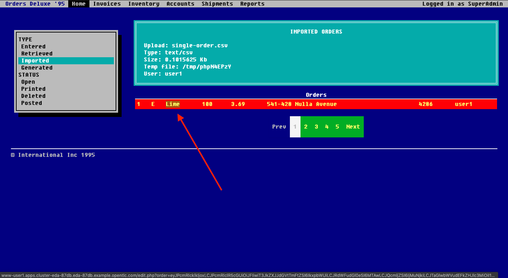
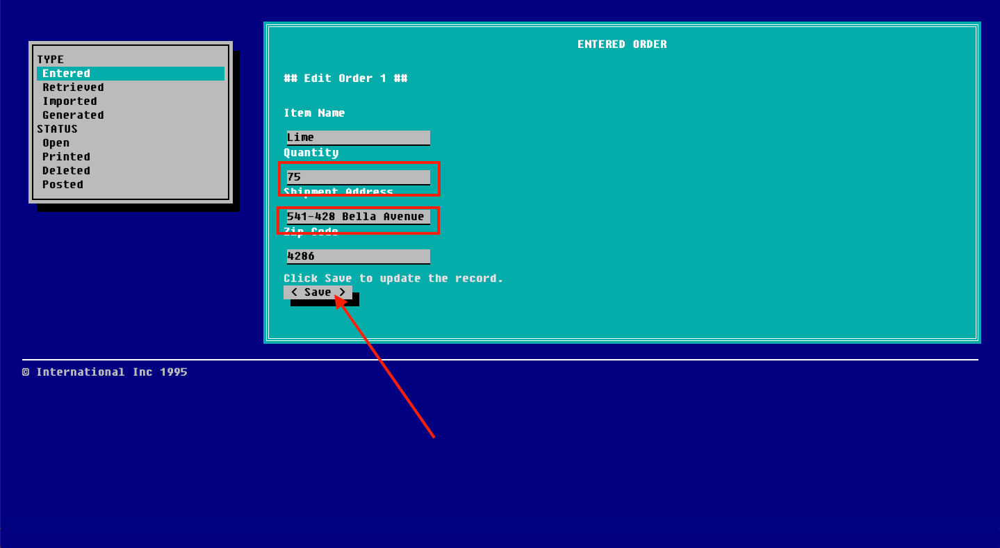

:walkthrough: Stream change events from your database
:che-url: http://che-che.{openshift-app-host}/
:terminal-url: https://terminal-terminal.{openshift-app-host}/hub/user/{user-username}
:next-lab-url: https://tutorial-web-app-webapp.{openshift-app-host}/tutorial/dayinthelife-streaming.git-labs-03-Cloud-Native-Integration/
:user-password: openshift

ifdef::env-github[]
:next-lab-url: ../lab03/walkthrough.adoc
endif::[]

[id='change-data-capture']
= Lab - Change Data Capture

In this lab you will enable Change Data Capture (CDC) for a legacy application that loads the customer orders from a comma separated value (CSV) file. This old PHP application can't be modified so there is no way to modernize it without risks. You will enable CDC on the SQL server database where the orders are stored and create a Kafka Connect deployment using AMQ streams to emit data change events (using Debezium) to the Earth Apache Kafka cluster.

*Audience:* Enterprise Integrators, System Architects, Developers, Data Integrators

*Overview*

Apache Kafka is the de facto standard for asynchronous event propagation between microservices. Things get challenging, though, when adding a service’s database to the picture: how can you avoid inconsistencies between Kafka and the database?

Enter Change Data Capture (CDC) and Debezium. By capturing changes from the log files of the database, Debezium gives you both reliable and consistent inter-service messaging via Kafka and instant read-your-own-write semantics for services themselves.

*Why Red Hat?*

To respond to business demands quickly and efficiently, you need a way to integrate applications and data spread across your enterprise. Red Hat® AMQ—based on open source communities like Apache ActiveMQ and Apache Kafka—is a flexible messaging platform that delivers information reliably, enabling real-time integration and connecting the Internet of Things (IoT).

AMQ streams component makes Apache Kafka “OpenShift native” through the use of powerful operators that simplify the deployment, configuration, management, and use of Apache Kafka on OpenShift.
Part of the Red Hat Integration product, Debezium offers low-latency change data capture for a variety of databases.

*Credentials*

Use the following credentials to login into the web consoles:

Your username is: `{user-username}` +
Your password is: `{user-password}`

[type=walkthroughResource,serviceName=codeready]
.Red Hat CodeReady Workspaces
****
* link:{che-url}[Console, window="_blank", , id="resources-codeready-url"]
****
[type=walkthroughResource]
.Red Hat OpenShift Developer Console
****
* link:{openshift-host}/topology/ns/{user-username}[Topology View, window="_blank"]
****

:sectnums:

[time=10]
[id="configure-cdc-connectors"]
== Configure CDC connectors for Kafka Connect

There is already a Kafka deployment running. We will then deploy a Kafka Connect CDC connector to connect to that cluster while we extract the data from the SQL Server database.

=== Deploy KafkaConnect CDC Connector

link:https://kafka.apache.org/documentation/#connect[Kafka Connect] is a tool for streaming data between Apache Kafka and external systems. It provides a framework for moving large amounts of data into and out of your Kafka cluster while maintaining scalability and reliability. Kafka Connect is typically used to integrate Kafka with external databases and storage and messaging systems.

AMQ Streams allows you to:

- Create a Kafka Connect image containing the connectors you want
- Deploy and manage a Kafka Connect cluster running within OpenShift using a KafkaConnect resource
- Deploy Kafka Connect connectors like Debezium

The Cluster Operator can use images that you create to deploy a Kafka Connect cluster to your OpenShift cluster.

A Kafka Connect cluster is implemented as a Deployment with a configurable number of workers.

. Go back, or Open a new tab with the OpenShift Developer Console link:{openshift-host}/topology/ns/{user-username}[Topology View, window="_blank"].
+
[IMPORTANT]
====
Be sure to be in your _{user-username}_ project
====

. Click *+Add* on the left menu.
+
image::images/topology-add.png[Topology Add, role="integr8ly-img-responsive"]

. Click on the *From Catalog* option.
+
image::images/add-from-catalog.png[OpenShift From Catalog, role="integr8ly-img-responsive"]

. Type in `kafka` in the search text field and then click on *KafkaConnect*.
+
image::images/openshift-kafkaconnect.png[OpenShift KafkaConnect, role="integr8ly-img-responsive"]

. Click on *Create* button.
+
image::images/openshift-create-kafkaconnect.png[OpenShift KafkaConnect, role="integr8ly-img-responsive"]

. Create a `KafkaConnect` Kubernetes Custom Resource to define your connector. We have already created a _container image_ with the *Red Hat Integration CDC* connectors for your. Replace the _YAML_ editor with the following code:
+
[source,yaml,subs="attributes+"]
----
apiVersion: kafka.strimzi.io/v1beta1
kind: KafkaConnect
metadata:
  name: debezium
  annotations:
    strimzi.io/use-connector-resources: "true"
spec:
  bootstrapServers: 'user-kafka-bootstrap:9092'
  image: 'quay.io/hguerreroo/rhi-cdc-connect:2020-Q1'
  replicas: 1
  resources:
    requests:
      memory: 2Gi
    limits:
      memory: 2Gi
  jvmOptions:
    gcLoggingEnabled: false
  config:
    group.id: {user-username}-debezium-cluster
    offset.storage.topic: {user-username}-debezium-cluster-offsets
    config.storage.topic: {user-username}-debezium-cluster-configs
    status.storage.topic: {user-username}-debezium-cluster-status
----

. Click on *Create* button.
+
image::images/openshift-kafkaconnect-detail.png[OpenShift Kafka Resource, role="integr8ly-img-responsive"]

. Click again in the *KafkaTopic* tab.
// +
// image::images/openshift-kafkaconnect-detail.png[OpenShift Kafka Resource, role="integr8ly-img-responsive"]

. You should see the _topics_ created by the *Debezium* Kafka Connect cluster.

=== Configure KafkaConnect CDC Connector

When you have created a container image for your connector plug-in, you need to create a connector instance in your Kafka Connect cluster. You can then configure, monitor, and manage a running connector instance.

AMQ Streams provides two APIs for creating and managing connectors:

- KafkaConnector resources (referred to as KafkaConnectors)
- Kafka Connect REST API

*KafkaConnectors* allow you to create and manage connector instances for Kafka Connect in an OpenShift-native way, so an HTTP client such as cURL is not required. Like other Kafka resources, you declare a connector’s desired state in a *KafkaConnector* _YAML_ file that is deployed to your OpenShift cluster to create the connector instance.

. Click *+Add* on the left menu.

. Click on the *From Catalog* option.

. Type in `kafka` in the search text field and then click on *Kafka connector*.

. Click on *Create* button.

. Replace the contents of the YAML editor with the following code:
+
[source,yaml,subs="attributes+"]
----
apiVersion: kafka.strimzi.io/v1alpha1
kind: KafkaConnector
metadata:
  name: orders-connector
  labels:
    strimzi.io/cluster: debezium
spec:
  class: io.debezium.connector.sqlserver.SqlServerConnector
  tasksMax: 1
  config:
    connector.class: "io.debezium.connector.sqlserver.SqlServerConnector"
    database.hostname: "mssql-server-linux.{user-username}.svc"
    database.port: "1433"
    database.user: "sa"
    database.password: "Password!"
    database.dbname: "InternationalDB"
    database.server.name: "{user-username}.db"
    table.whitelist: "dbo.Orders"
    database.history.kafka.bootstrap.servers: "user-kafka-bootstrap:9092"
    database.history.kafka.topic: "{user-username}.db.dbhistory"
----

. Then click the *Create* button to submit the configuration.

. In the operator page, change to the *Kafka Topic* back again. You should see now the `{user-username}.db.dbhistory` _topic_ being created.

. Get back to the Topology view and check the log in the *debezium-cluster* deployment. 

[type=verification]
Did the connector started correctly and is now reading the database transaction log?
[type=verificationFail]
Verify that you followed each step in the procedure above. If you are still having issues, contact your administrator.

[time=10]
[id="loading-earth-orders"]
== Loading Earth Orders

It's now time to test the Change Data Capture integration.

- We will first load the CSV data into MSSQL using a PHP app
- Debezium will populate data from MSSQL into the Kafka topic

Let's get started!

=== Loading Orders File

Debezium’s SQL Server Connector can monitor and record the row-level changes in the schemas of a SQL Server database.

The functionality of the connector is based upon the link:https://docs.microsoft.com/en-us/sql/relational-databases/track-changes/about-change-data-capture-sql-server?view=sql-server-2017[change data capture] feature provided by SQL Server Standard (since SQL Server 2016 SP1) or Enterprise edition.

. Download to your local system the link:https://raw.githubusercontent.com/RedHatWorkshops/dayinthelife-streaming/master/support/module-1/single-order.csv[Single Order File, window="_blank"].

. Navigate to the legacy PHP link:http://www-{user-username}.{openshift-app-host}/[Enterprise System, window="_blank"] in a new browser tab.
+
image:images/www-main.png[PHP System]

. Click on the *Choose File* button to load the _orders_ file.
+
image:images/www-choose-file.png[Choose File]

. Load the _CSV_ file you just downloaded. Click on the *Open* button.
+
image:images/www-orders-file.png[Orders File]

. Now, click the *Load File* button. This will load the file orders and insert them in the database.
+
image:images/www-load-file.png[Load File]

.  Wait a few seconds for the information to load. If this is successfully completed, you will see the CSV data on the *Imported Orders* page.
+
image::images/www-imported-orders.png[Imported Orders]

=== Check Database Records

After loading the file into the system, the orders data  should be stored in the MSSQL Server database. Let's check to make sure that's the case.

. Go back to the topology view of the OpenShift Developer console.

. Click on the database deployment to open the overview page. Then click on the *Resources* tab and next the _Pod_ name.
+
image:images/openshift-db-overview.png[Access Pod]

. Now, click on the *Terminal* tab to access the pod's shell.
+
--
image:images/openshift-db-terminal.png[Pod Terminal]

[TIP]
====
If you feel comfortable, you can also use the OpenShift CLI command `oc rsh` to access the database pod as well.
====
--

. Run the following command to access the database:
+
[source,bash,subs="attributes+"]
----
/opt/mssql-tools/bin/sqlcmd -S mssql-server-linux -U sa -P Password! -d InternationalDB -Q "select top 5 * from dbo.Orders where OrderUser='{user-username}'"
----

. Check the results, should look like this:
+
image::images/openshift-sqlcommand.png[Query]

=== Check Apache Kafka Records

We checked that the database had the _orders_ data. Is now time to check that the Change Data Capture connector was able to query the transaction log and generate the Apache Kafka events to the cluster.

. Validate that the *KafkaTopics* were created.
+
--
- Expand the *Advanced* menu on the left menu bar.
- Click on *Search* to load the _resources_ search page.
- Click on the _Resource Type_ field and type 'topic'.
- Finally select *KafkaTopic*.

image::images/openshift-search-kafkatopics.png[Search KafkaTopics]

[TIP]
====
This an alternative way to search for resources in the OpenShift developer console.
====
--

. This will display the topics on the _Kafka cluster_. You should be able to locate your `{user-username}-connect-cluster*` as well as the `{user-username}.earth.dbo.orders--*` _KafkaTopics_.
+
image::images/openshift-cdc-topics.png[CDC KafkaTopics]

[type=verification]
Were you able to see that your Change Data Capture connector has access to Kafka?

[type=verificationFail]
Verify that you followed each step in the procedure above. If you are still having issues, contact your administrator.

=== Inspect Kafka records

Time to check what information is flowing into Apache Kafka.

. Go back to the topology view. We will access one of the Kafka brokers.

. Click on the `user kafka` _stateful set_.

. Click on the *Resources* tab.

. Click on the `user-kafka-0` pod to access the details.
+
image::images/openshift-kafka-deployment.png[Kafka Pods]

. Click on the *Terminal* tab to access this pod's shell.
+
image::images/openshift-kafka-terminal.png[Kafka Pods]
+
[IMPORTANT]
====
Red Hat provides its own complete Apache Kafka distribution container images. We will use the `kafka-console-consumer.sh` script to query the topics.
====

. Issue the following command to read *all* the events in the `orders` topic:
+
[source,bash,subs="attributes+"]
----
bin/kafka-console-consumer.sh --bootstrap-server localhost:9092 --topic {user-username}.db.dbo.Orders --from-beginning
----

. You should see the json output of the messages. Something like this:
+
[source,bash,subs="attributes+"]
----
...
{"type":"string","optional":true,"field":"change_lsn"},{"type":"string","optional":true,"field":"commit_lsn"}],"optional":false,"name":"io.debezium.connector.sqlserver.Source","field":"source"},{"type":"string","optional":false,"field":"op"},{"type":"int64","optional":true,"field":"ts_ms"}],"optional":false,"name":"user1.earth.dbo.Orders.Envelope"},"payload":{"before":null,"after":{"OrderId":1000,"OrderType":"E","OrderItemName":"Mocha Irish Cream","Quantity":168,"Price":"4.30","ShipmentAddress":"P.O. Box 511, 4483 Ornare Rd.","ZipCode":"C5X 6L8","OrderUser":"user1"},"source":{"version":"0.10.0.Beta2-redhat-00001","connector":"sqlserver","name":"user1.earth","ts_ms":1584993092410,"snapshot":"false","db":"InternationalDB","schema":"dbo","table":"Orders","change_lsn":"00000027:00000038:0002","commit_lsn":"00000027:00000038:0003"},"op":"c","ts_ms":1584993096494}}
----

. Copy the string from the terminal.

. Open in a new browser tab `https://jsonformatter.org/json-pretty-print`.

. Paste in the left side and click on Make Pretty so you can check the actual format of the message json payload.

. You will be able to see the `schema` field and the `payload` field.

. Under the _payload_ check you can see there is no `before` value as this was just an *insert* operation. The value should be `null`.

. Type in some `Enter` keystrokes in the Kafka terminal to make space to separate the next record coming to the Topic.

[type=verification]
Were you able to see the structure of debezium records?

[type=verificationFail]
Verify that you followed each step in the procedure above. If you are still having issues, contact your administrator.

=== Issue an update operation

. Now get back to the PHP _Enterprise Application_ where you will now *Edit* the record to produce another change in the database.

. In the main page, click on the *Order* table to get to the edit page.
+

. You will get to the edit page. Do some changes to the order `quantity` and the `shipping address` information. 

. Click on *< Save >* to make the changes.
+

. You should be able to see the *Success* green message.
+

. Get back to the _Kafka broker_ terminal and check what happened. You should see a new record has been received.

. Get back again to the browser tab `https://jsonformatter.org/json-pretty-print`.

. Paste the new record you just received. Check the new structure.

[type=verification]
Were you able to check the changes in the structure now with the `before` value?

[type=verificationFail]
Verify that you followed each step in the procedure above. If you are still having issues, contact your administrator.

[time=10]
[id="enabling-http-access"]
== Using Single Message Transformations (SMT)

Connectors can be configured with transformations to make lightweight message-at-a-time modifications. They can be convenient for data massaging and event routing.

A transformation chain can be specified in the connector configuration.

- `transforms` - List of aliases for the transformation, specifying the order in which the transformations will be applied.
- `transforms.$alias.type` - Fully qualified class name for the transformation.
- `transforms.$alias.$transformationSpecificConfig` - Configuration properties for the transformation

Single Message Transformations (SMTs) are applied to messages as they flow through Connect. SMTs transform inbound messages after a source connector has produced them, but before they are written to Kafka.
Alternatively, they can be applied to outbound messages, before a sink connector consumes them.

Debezium generates data change events in a form of a complex message structure. Each event consists of three parts:

- metadata, comprising the type of operation, information on the event source, a timestamp, and optionally transaction information
- the row data before change
- the row data after change

Debezium provides a single message transformation that crosses the bridge between the complex and simple formats, the `ExtractNewRecordState` SMT.

The SMT provides three main functions. It

- extracts the after field from change events and replaces the original event just with this part

- optionally filters delete and tombstone records, as per the capabilities and requirements of downstream consumers

- optionally adds metadata fields from the change event to the outgoing flattened record

- optionally adds metadata fields to the record headers

The SMT can be applied either to a source connector (Debezium) or a sink connector.

=== Edit the connector configuration

. Get back to the Search page and look for the `KafkaConnector` resource.

. Select the `orders-connector` and delete it.

. Click on create new KafkaConnector and replace the editor YAML with the following code:
+
[source,yaml,subs="attributes+"]
----
apiVersion: kafka.strimzi.io/v1alpha1
kind: KafkaConnector
metadata:
  name: order-connector-smt
  labels:
    strimzi.io/cluster: debezium
spec:
  class: io.debezium.connector.sqlserver.SqlServerConnector
  tasksMax: 1
  config:
    connector.class: "io.debezium.connector.sqlserver.SqlServerConnector"
    database.hostname: "mssql-server-linux.{user-username}.svc"
    database.port: "1433"
    database.user: "sa"
    database.password: "Password!"
    database.dbname: "InternationalDB"
    database.server.name: "{user-username}.smt"
    table.whitelist: "dbo.Orders"
    database.history.kafka.bootstrap.servers: "user-kafka-bootstrap:9092"
    database.history.kafka.topic: "{user-username}.db.dbhistory"
    key.converter: "org.apache.kafka.connect.json.JsonConverter"
    key.converter.schemas.enable: "false"
    value.converter: "org.apache.kafka.connect.json.JsonConverter"
    value.converter.schemas.enable: "false"
    transforms: "extract"
    transforms.extract.type: "io.debezium.transforms.ExtractNewRecordState"
    transforms.extract.add.fields: "op,table"
----

. Get back to the `Kafka broker` terminal and run the following command to get the records:
+
[source,bash,subs="attributes+"]
----
bin/kafka-console-consumer.sh --bootstrap-server localhost:9092 --topic {user-username}.smt.dbo.Orders --from-beginning
----

. As you can see now, the records are more friendly so we can process them easily in the next steps.

[type=verification]
Were you able to see the new _simple_ format of the message?

[type=verificationFail]
Verify that you followed each step in the procedure above. If you are still having issues, contact your administrator.

[time=10]
[id="sink"]
== Sending events out of Kafka to Elasticsearch

The Apache Camel community introduced recently a new subproject in the ecosystem: Camel-Kafka-Connector. The main idea behind the project is reusing the Camel components’ flexibility in a simple way, through a configuration file mixing Kafka Connect configuration and Camel route definitions and options.

Camel Kafka Connector allows you to use all Camel components as Kafka Connect connectors, which as result expands Kafka Connect compatibility to include all Camel components to be used in Kafka ecosystem.

One of the main reasons to generate Kafka events from the Orders MSSQL server database is being able to share the information with other systems. In this case, the order fullfillment team requires to search the orders to find _business critical_ information. 

=== Create the Apache Camel Kafka Connect cluster

. Go back, or open a new tab with the OpenShift Developer Console link:{openshift-host}/topology/ns/{user-username}[Topology View, window="_blank"].

. Click *+Add* on the left menu.
+
image::images/topology-add.png[Topology Add, role="integr8ly-img-responsive"]

. Click on the *From Catalog* option.
+
image::images/add-from-catalog.png[OpenShift From Catalog, role="integr8ly-img-responsive"]

. Type in `kafka` in the search text field and then click on *KafkaConnect*.
+
image::images/openshift-kafkaconnect.png[OpenShift KafkaConnect, role="integr8ly-img-responsive"]

. Click on *Create* button.
+
image::images/openshift-create-kafkaconnect.png[OpenShift KafkaConnect, role="integr8ly-img-responsive"]

. Create a `KafkaConnect` Kubernetes Custom Resource to define your connector. We have already created a _container image_ with the *Red Hat Integration CDC* connectors for your. Replace the _YAML_ editor with the following code:
+
[source,yaml,subs="attributes+"]
----
apiVersion: kafka.strimzi.io/v1beta1
kind: KafkaConnect
metadata:
  name: camel
  annotations:
    strimzi.io/use-connector-resources: "true"
spec:
  bootstrapServers: 'user-kafka-bootstrap:9092'
  image: 'quay.io/hguerreroo/camel-es-kafka-connect'
  replicas: 1
  resources:
    requests:
      memory: 2Gi
    limits:
      memory: 2Gi
  jvmOptions:
    gcLoggingEnabled: false
  config:
    group.id: {user-username}-camel-cluster
    offset.storage.topic: {user-username}-camel-cluster-offsets
    config.storage.topic: {user-username}-camel-cluster-configs
    status.storage.topic: {user-username}-camel-cluster-status
----

. Click on *Create* button.

[type=verification]
Is this Kafka Connect instance up and running?

[type=verificationFail]
Verify that you followed each step in the procedure above. If you are still having issues, contact your administrator.

=== Starting the Apache Camel Elasticsearch connector

. Click again on *+Add*. 

. Click on *From Catalog*.

. Type `kafka` to filter and then click on *KafkaConnector*. 

. Click on the *Create* button.

. Replace the contents of the YAML editor with the following code:
+
[source,yaml,subs="attributes+"]
----
apiVersion: kafka.strimzi.io/v1alpha1
kind: KafkaConnector
metadata:
  name: camel-es-connector
  labels:
    strimzi.io/cluster: camel
spec:
  class: org.apache.camel.kafkaconnector.CamelSinkConnector
  tasksMax: 1
  config:
    key.converter: org.apache.kafka.connect.storage.StringConverter
    value.converter: org.apache.kafka.connect.storage.StringConverter
    camel.sink.url: elasticsearch-rest://elasticsearch?hostAddresses=elasticsearch.elastic.svc:9200&operation=Index&indexName={user-username}-orders
    topics: {user-username}.smt.dbo.Orders
----

. Then click the *Create* button to submit the configuration.

. The connector should start processing the orders and inserting them into ElasticSearch for indexing. 

. Open a new browser tab and navigate to the following link:http://elastic-elastic.{openshift-app-host}/{user-username}-orders/_search[Elasticsearch results page].

[type=verification]
Were you able to see the records? *Congratulations!* You have successfuly implemented CDC with Red Hat Integration.

[type=verificationFail]
Verify that you followed each step in the procedure above. If you are still having issues, contact your administrator.

[time=5]
[id="summary"]
== Summary

In this lab you used Debezium CDC connectors to react to change events from SQL Server and send them to Apache Kafka running on OpenShift through Red Hat AMQ streams.

Open source connectors enable integrations with your local systems landscape. Explore Kafka, Camel, and Debezium connectors to connect APIs and services for event-driven application architectures (EDA). Red Hat offers supported versions of these connectors via AMQ Streams and Fuse.

[time=4]
[id="further-reading"]
== Notes and Further Reading

* https://www.redhat.com/en/technologies/jboss-middleware/amq[Red Hat AMQ]
* https://developers.redhat.com/topics/event-driven/connectors/[Camel & Debezium Connectors]
* https://debezium.io/[The upstream Debezium project]
